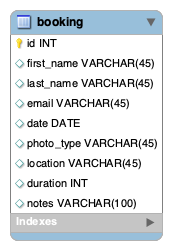

## EventTrackerProject

This project is a tracker for photography bookings. A user is able to perform CRUD operations on a photography booking database belonging to a single photographer. Response codes were also created to show the status of a request based on the request.

### Technologies used:
* Spring REST Services
* JPARepository
* Postman
* Java
* Gradle
* Git
* MySQL
* MySQL Workbench
* AWS EC2
* XML
* Github
* Eclipse
* Atom

### Database
The database used is collection of data on photography bookings for a single photographer. Booking information for each client  in the database includes the first name, last name, booking date, type of event (e.g. portrait session), location, etc.

### Classes
#### Booking Entity
A gradle project was created to store the booking entity and a Junit test case was conducted to confirm correct mappings.

#### Other Classes
A separate Spring Starter Project was created to hold the controller, service, repository classes for the booking entity.  The main service class holds methods for conducting CRUD operations on the booking database.

### Postman
Postman test were created to check for correct mappings. A user is able view a list of all bookings in the database, find a booking by its id, create a new booking, update a booking, and/or delete a booking. Status codes were also added and implemented confirm the status of a request.

### Lessons learned:
I am learning more about the ease of use that with JPARepository.
